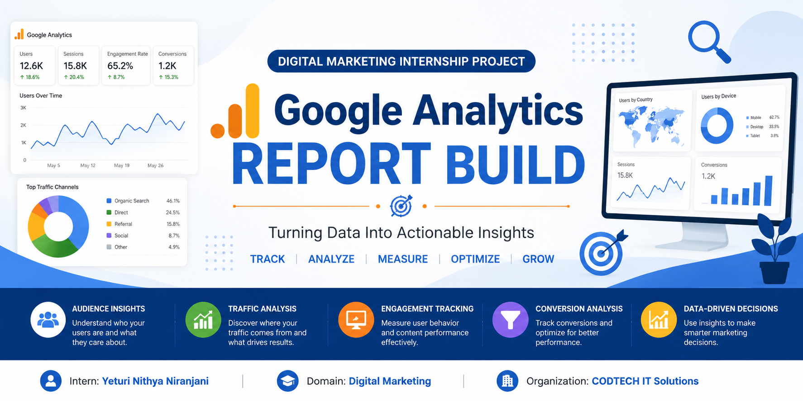

  

# 📊 Google Analytics Report Build

## 👩‍💻 Intern Details
- **Intern Name:** Yeturi Nithya Niranjani  
- **Intern ID:** CITS1133  
- **Internship Domain:** Digital Marketing  
- **Organization:** CODTECH IT Solutions  
- **Project Title:** Google Analytics Report Build

---

## 📌 Project Overview
The Google Analytics Report Build project focuses on collecting, analyzing, and interpreting website performance data. In today’s digital world, data plays a key role in understanding customer behavior, measuring campaign performance, and making informed business decisions. This project demonstrates how web analytics can be used to evaluate marketing performance and convert raw data into meaningful insights.

The main objective is to transform raw website data into a structured performance report. By analyzing metrics such as audience behavior, traffic sources, and user engagement, the project helps identify strengths, opportunities, and areas for improvement.

---

## 🎯 Objectives
- Collect and analyze website data using Google Analytics.  
- Understand audience behavior and user interaction patterns.  
- Identify the most effective traffic sources.  
- Monitor key performance indicators (KPIs).  
- Evaluate digital marketing performance.  
- Create a structured and professional analytics report.  
- Generate actionable insights to improve website performance.  

---

## 🛠️ Tools & Technologies Used
- Google Analytics 4 (GA4): Used for tracking website traffic, user behavior, and engagement metrics.  
- Google Sheets: Used for organizing and managing analytical data.  
- Microsoft Excel: Used for detailed data analysis and calculations.  
- Canva: Used for designing charts and visual reports.  
- Microsoft PowerPoint: Used for presenting findings in a structured format.  

---

## ⚙️ Methodology
- **Data Collection:** Collected website performance data from Google Analytics.  
- **Audience Analysis:** Studied user demographics and behavior patterns.  
- **Traffic Source Evaluation:** Analyzed organic, direct, referral, and social traffic.  
- **Engagement Assessment:** Evaluated user interaction with website content.  
- **Data Interpretation:** Identified trends, user behaviour patterns, and performance insights.
- **Report Generation:** Created structured reports with visual representations.  

---

## 📊 Key Performance Indicators (KPIs)
- Total Users & New Users  
- Sessions & Page Views  
- Engagement Rate & Average Engagement Time  
- Traffic Acquisition Channels  
- Device Categories (Mobile, Desktop, Tablet)  
- Geographic Distribution  
- Conversion Rate  

---

## 📈 Key Findings
- Organic search generated a significant portion of website traffic.
- Mobile users contribute significantly to overall traffic.  
- Engagement varies across different traffic channels.  
- Certain landing pages perform better in retaining users.  
- Data analysis helps identify optimization opportunities for conversions.  

---

## 📉 Data Visualization & Reporting
The collected data was transformed into easy-to-understand visuals, including:
- Traffic overview dashboards  
- Audience behavior reports  
- Device performance analysis  
- Engagement tracking charts  

These visualizations helped simplify complex data and improved decision-making clarity.

---

## 🧠 Key Learnings
- Gained hands-on experience with Google Analytics 4.  
- Learned how to interpret website performance data.  
- Improved understanding of user behavior analysis.  
- Developed skills in reporting and data visualization.  
- Understood how analytics supports marketing decisions.  

---

## 🚀 Benefits of the Project
- Improved knowledge of web analytics tools.  
- Strengthened digital marketing understanding.  
- Enhanced data analysis and interpretation skills.  
- Gained experience in professional report creation.  

---

## 📋 Conclusion
The Google Analytics Report Build project demonstrates the importance of data-driven decision-making in digital marketing. By analyzing website traffic, engagement, and user behavior, meaningful insights were generated to evaluate performance and identify improvement areas. This project provided practical exposure to analytics and strengthened analytical and reporting skills.

